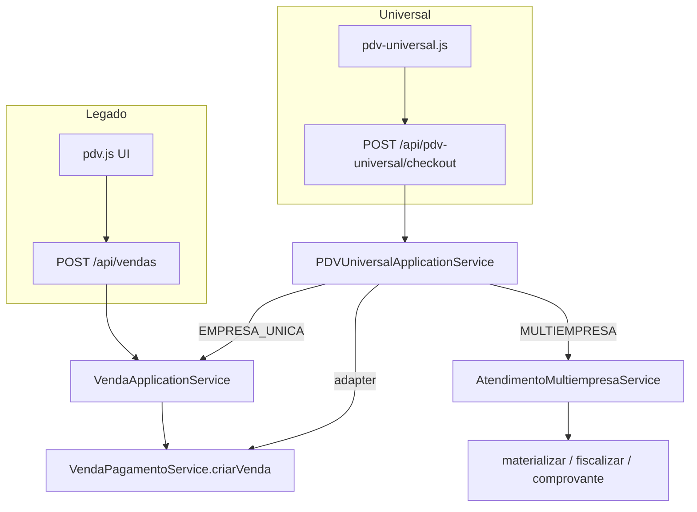

# MAPA DE FLUXOS A1 — PDV OPERACIONAL

**Sprint:** 05.29.A.1  
**Objetivo:** Rastrear UI → função → API → rota → service → resultado (Legado × Universal)

---

## 1. PDV / CARRINHO

### Legado (`frontend/pdv/js/pdv.js`)

```
#buscaProdutoPdv (Enter) / #btnBuscarProdutoPdv
  → adicionarProdutoPorCodigo()
  → adicionarProdutoPorCodigoViaMip()
      ├─ EAN-13 balança (^2\d{12}$)
      │    → POST /api/equipamentos/etiquetas/interpretar  [LayoutEtiquetaService]
      │    → POST /api/produtos/identificar               [MIP]
      │    → calcularItemEtiquetaBalancaPdv()             [local: peso/valor → qty]
      └─ demais códigos
           → POST /api/produtos/identificar
  → adicionarItemNoCarrinho()                             [array carrinho local]
  → atualizarCarrinho()                                   [DOM]
RESULTADO: item no carrinho; subtotal recalculado localmente
```

```
F1 / consulta modal
  → abrirConsultaProdutosPDV()
  → GET /api/produtos/consulta-pdv/buscar?q=
  → adicionarProdutoConsultaPDV() → fluxo carrinho
```

```
#descontoPdv / #acrescimoPdv / qty / remover
  → handlers bindEventosPDV
  → MotorPrecoAtacado (atacado) + cálculo local
RESULTADO: carrinho atualizado (sem API)
```

### Universal (`frontend/pdv-universal/`)

```
#pdvu-busca-input (Enter)
  → executarIdentificacaoOperacional()
  → PdvUniversalIdentificacao.identificarEntradaPdv()
      → POST /api/produtos/identificar
      → fallback GET /api/produtos/consulta-pdv/buscar?q=
  → tentarAdicionar()
      → GET /api/pdv-universal/produtos/:id/disponibilidade  [PDVUniversalDisponibilidadeService]
      → PDVUniversalCart.adicionarItem()                     [local]
  → pintarCarrinho() → calcularTotaisOperacionais()
RESULTADO: item no carrinho (produto_id + empresa_id)
```

```
[-] [input qtd] [+] / REMOVER / PESAR (05.26–05.29)
  → aplicarQuantidadeLocal() / removerItemManualUi() / confirmarPesagemManual()
  → PDVUniversalCart (sem HTTP)
RESULTADO: qty decimal se produto_fracionado=1
```

**Gap confirmado:** etiqueta balança não conectada no Universal (`quantidadeOperacionalPadrao` = 1).

---

## 2. FINALIZAÇÃO / VENDA

### Legado

```
#btnFinalizarVendaPdv / F10
  → abrirTelaPagamento() → abrirTelaPagamentoBalcao()
  → selecionarPagamentoPDV() / abrirPagamentoMisto()
  → mostrarModalDecisaoFiscal()
  → prosseguirFinalizacaoConformeModoFiscal()
  → executarFinalizacaoVenda()
      → POST /api/vendas/pre-calcular-distribuicao  [opcional F×NF]
      → ramos TEF / PIX / dinheiro
      → enviarVenda()
          → POST /api/vendas
              → validarCaixaSeOrigemPdv
              → VendaApplicationService.criarVenda()
                  → EMPRESA_UNICA: VendaPagamentoService.criarVenda()
                  → MULTIEMPRESA: AtendimentoMultiempresaService.criarAtendimento()
RESULTADO: venda_id; estoque debitado; pagamentos; NFC-e opcional
  → processarFiscalPosPagamentoPosVenda()
      → POST /api/fiscal/emitir/venda/:id
  → imprimirCupomNaoFiscal() / imprimirDANFEFiscal()
```

### Universal — EMPRESA_UNICA

```
#pdvu-finalizar / F10
  → ramo forma:
      DINHEIRO:
        → PdvUniversalCheckout.finalizarCheckout()
            → POST /api/pdv-universal/checkout
                → PDVUniversalApplicationService.finalizarCheckout()
                → PDVUniversalVendaAdapter → EmpresaUnicaAdapter
                → VendaPagamentoService.criarVenda()    ← MESMO NÚCLEO
      PIX:
        → POST /api/pix/criar-cobranca → GET /api/pix/status/:txid
        → após PAGO → POST /api/pdv-universal/checkout
      TEF:
        → POST /api/tef/pagar
        → após aprovado → POST /api/pdv-universal/checkout
RESULTADO: venda_id; carrinho limpo
```

### Universal — MULTIEMPRESA

```
#pdvu-finalizar
  → POST /api/pdv-universal/checkout
      → AtendimentoMultiempresaService.criarAtendimento()
RESULTADO: atendimento preview (pagamento_pendente)

#pdvu-continuar-pagamento
  → POST /api/pdv-universal/atendimentos/:id/reservar
  → modal pagamento unificado
  → POST /api/pdv-universal/atendimentos/:id/pagamento

#pdvu-materializar / #pdvu-fiscalizar
  → POST .../materializar → POST .../fiscalizar
  → GET .../comprovante → POST /api/atendimentos/:id/imprimir
```

**Conclusão:** existem **dois checkouts de entrada** (`/api/vendas` vs `/api/pdv-universal/checkout`), mas EMPRESA_UNICA converge no **mesmo motor** `VendaPagamentoService.criarVenda`.

---

## 3. CAIXA

### Legado — consulta na venda

```
loadPDV / verificarStatusCaixa
  → GET /api/caixa/aberto
      → FechamentoCaixaResumoService.calcularResumoCaixa
RESULTADO: bloqueio visual se fechado; POST /api/vendas exige caixa (middleware)
```

### Legado — operação (página caixa)

```
loadCaixa()
  → GET /api/caixa/aberto
  → POST /api/caixa/abrir | /sangria | /suprimento | /fechar
RESULTADO: sessão caixa; cupom_html no fechamento (print local)
```

### Universal

```
atualizarStatusCaixa()
  → GET /api/caixa/aberto
RESULTADO: badge VERIFICANDO/ABERTO/FECHADO (sem bloqueio front FINALIZAR)
#pdvu-btn-fechar-caixa → disabled (sem handler)
```

---

## 4. PAGAMENTOS

| Forma | Legado | Universal EMPRESA_UNICA | Universal MULTIEMPRESA |
|-------|--------|----------------------|------------------------|
| Dinheiro | modal → POST /api/vendas | checkout direto | modal intenções → POST pagamento |
| Débito/Crédito | TefFluxoPagamento → POST /api/tef/pagar → POST /api/vendas | POST /api/tef/pagar → checkout | intenção only (sem TEF front) |
| PIX direto | POST pix/* → POST /api/vendas | POST pix/* → checkout | gate PIX_MULTIEMPRESA_NAO_IMPLEMENTADO |
| PIX TEF | TefFluxoPagamento → POST /api/tef/pagar | **Não implementado** | **Não** |
| Misto | abrirPagamentoMisto + TEF/PIX | **Não** | parcial (intenções, sem TEF) |
| Prazo | mostrarModalClientePrazo | **Não** | **Não** |
| Voucher | prestação entrega | **Não** | **Não** |

---

## 5. TEF

### Legado (com fluxo compartilhado)

```
Pagamento cartão
  → TefFluxoPagamento.resolverFluxoPagamentoFiscal()
      → GET /api/tef/fluxo-pdv
      → GET /api/configuracoes-avancadas/confirmacao-fiscal
  → processarPagamentoTEF()
      → POST /api/tef/pagar
          → services/tef → TefManager.autorizar()
              → TefFiscalValidator, tefFraudDetection, tefFactory (pinpad)
              → tefRepository (tef_transacoes)
RESULTADO: aprovado/negado; comprovante
  → POST /api/impressao/tef (slip USB)
  → POST /api/vendas (com dados TEF)
```

### Universal

```
#pdvu-forma debito/credito + FINALIZAR
  → PdvUniversalTef.iniciarTransacaoTef()
      → POST /api/tef/pagar          [mesmo backend]
  → Tef.estaAprovado()
  → PdvUniversalCheckout.finalizarCheckout()
      → POST /api/pdv-universal/checkout
RESULTADO: venda após aprovação TEF

NÃO USA: tefFluxoPagamento.js, GET /api/tef/fluxo-pdv, POST /api/tef/cancelar
```

---

## 6. PIX

### Legado — PIX direto (TEF off)

```
selecionarPagamentoPDV('pix')
  → GET /api/pix/config
  → POST /api/pix/criar-cobranca  [pixService → provider]
  → poll GET /api/pix/status/:txid
  → executarFinalizacaoVenda() → POST /api/vendas
```

### Universal

```
forma=pix + FINALIZAR
  → POST /api/pix/criar-cobranca
  → poll GET /api/pix/status/:txid (60× 2s)
  → POST /api/pdv-universal/checkout
```

**Duplicação:** adapters `pdv-universal-pix.js` vs funções inline em `pdv.js` — mesma API, lógica paralela.

---

## 7. ENTREGA

### Legado — reserva

```
F9 / #btnVendaEntregaPdv
  → PdvVendaEntrega.confirmarVendaEntrega()
  → GET /api/clientes?limit=200
  → POST /api/vendas { tipo_venda: 'ENTREGA', emitir_fiscal: false }
      → CriarVendaEntregaService.criarVendaEntrega()
RESULTADO: venda entrega reservada; comprovante_html opcional
```

### Legado — operação

```
Sidebar Entregas (entregas.js)
  → GET /api/vendas/entregas/dashboard
  → GET /api/vendas/entregas/por-entregador
  → POST /api/vendas/entregas/:id/iniciar

Footer Prestação (pdv-prestacao-entrega.js)
  → GET /api/vendas/entregas/por-entregador?status=...
  → POST /api/vendas/:id/prestacao
  → DELETE /api/vendas/:id/entrega
```

### Universal

```
(NÃO EXISTE — zero referências nos arquivos auditados)
```

---

## 8. BALANÇA / PESAGEM

### Legado — etiqueta EAN-13

```
codigoEhBalanca(EAN-13 prefixo 2)
  → POST /api/equipamentos/etiquetas/interpretar
      → EquipamentosService → LayoutEtiquetaService
  → calcularItemEtiquetaBalancaPdv() → adicionarItemNoCarrinho(qty=peso)
```

### Legado — manual

```
abrirModalQuantidadeProduto() / abrirModalModoVendaProduto()
  → qty decimal local (produto_fracionado)
```

### Universal

```
PESAR (05.29) → modal peso → PDVUniversalCart.aplicarQuantidadeInteira()
Edição qty decimal (05.28) → interpretarQuantidadeUi()

SEM: POST /api/equipamentos/*, balança serial, PesagemService
```

---

## 9. ETIQUETA DE BALANÇA

```
LEGADO:
  EAN-13 → POST /api/equipamentos/etiquetas/interpretar → PLU + peso/valor → carrinho

UNIVERSAL:
  POST /api/produtos/identificar → meta.peso disponível
  quantidadeOperacionalPadrao() → sempre 1
  POST /api/equipamentos/etiquetas/interpretar → NÃO CHAMADO
```

**Conclusão:** backend resolve; Universal **não conecta** — falta só wiring front.

---

## 10. IMPRESSÃO / COMPROVANTES

### Legado

```
Pós-venda balcão:
  → imprimirCupomNaoFiscal(vendaId)     [fiscalImpressao.js]
  → imprimirDANFEFiscal(vendaId)        [após POST /api/fiscal/emitir/venda/:id]

TEF:
  → POST /api/impressao/tef             [escpos USB]

Entrega:
  → comprovante_html da resposta POST /api/vendas → window.print / electronAPI

Caixa fechamento:
  → cupom_html POST /api/caixa/fechar → print local

Prestação:
  → comprovante_html / danfeHtml pós POST /api/vendas/:id/prestacao
```

### Universal

```
Preview:
  → GET /api/pdv-universal/atendimentos/:id/comprovante?formato=HTML
      → ComprovanteUnificadoAtendimentoService → ComprovanteRenderer

Impressão:
  → POST /api/atendimentos/:id/imprimir
      → ComprovantePrintService.imprimirComprovante()
      → BrowserPrintAdapter (destino BROWSER)

Materialização/fiscalização MUV antes do comprovante unificado.
```

**Serviços MUV confirmados:** `ComprovantePrintService`, `PrintAdapter`, `BrowserPrintAdapter`, `ThermalPrintAdapter`, `PreviewPrintAdapter` em `backend/motores/muv/impressao/`.

---

## Diagrama resumo — dois motores de checkout


